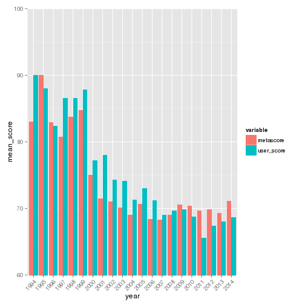
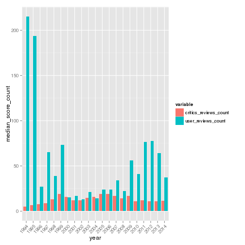
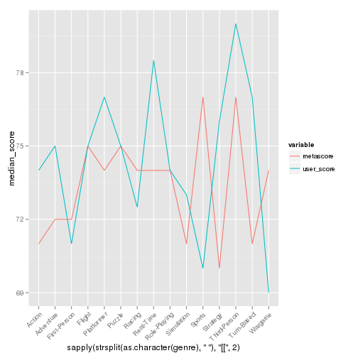
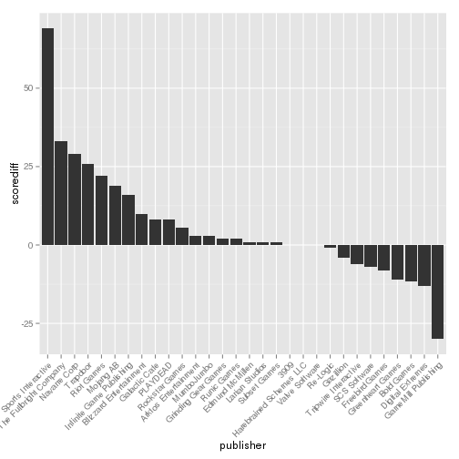

# Exploratory analysis of game data from metacritic.com


### Loading the data

```r
library(lubridate)
library(modeest)
library(reshape2)
library(ggplot2)
games <- read.csv('../../data/metacritic-20141019-152743.csv', na.strings="NA",
                  colClasses=c(release_date="Date"))
```


### Basic properties of a dataset

```r
str(games)
```

```
## 'data.frame':	3031 obs. of  13 variables:
##  $ user_score           : int  88 87 58 NA 82 65 73 87 83 NA ...
##  $ publisher            : Factor w/ 693 levels "10tacle Studios",..: 659 87 179 561 49 512 23 575 88 259 ...
##  $ title                : Factor w/ 3031 levels "007 Legends",..: 498 686 1461 358 925 1873 395 460 251 175 ...
##  $ critics_reviews_count: int  5 12 13 16 10 7 21 17 11 4 ...
##  $ release_date         : Date, format: "1995-08-31" "1996-11-30" ...
##  $ maturity_rating      : Factor w/ 7 levels "AO","E","E10+",..: NA 5 2 2 7 5 2 2 7 2 ...
##  $ metascore            : int  94 94 78 76 85 56 72 79 70 60 ...
##  $ platform             : Factor w/ 1 level "PC": 1 1 1 1 1 1 1 1 1 1 ...
##  $ link                 : Factor w/ 3031 levels "http://www.metacritic.com/game/pc/007-legends",..: 498 686 1461 358 925 1873 395 460 251 175 ...
##  $ user_reviews_count   : int  297 636 5 NA 22 47 12 25 6 NA ...
##  $ genre                : Factor w/ 15 levels "PC Action Games",..: 12 9 11 7 10 13 14 14 14 6 ...
##  $ genre_tags           : Factor w/ 95 levels "2D","3D","Action",..: 66 5 73 8 50 57 35 89 69 62 ...
##  $ developer            : Factor w/ 1328 levels "10tacle Studios",..: 1280 168 378 1128 97 991 47 100 223 1047 ...
```

```r
summary(games)
```

```
##    user_score                 publisher   
##  Min.   : 9.0   Electronic Arts    : 128  
##  1st Qu.:64.0   Ubisoft            : 124  
##  Median :74.0   Atari              :  92  
##  Mean   :70.8   Activision         :  79  
##  3rd Qu.:82.0   Paradox Interactive:  77  
##  Max.   :96.0   (Other)            :2528  
##  NA's   :249    NA's               :   3  
##                        title      critics_reviews_count
##  007 Legends              :   1   Min.   : 3.0         
##  007: NightFire           :   1   1st Qu.: 7.0         
##  10,000,000               :   1   Median :13.0         
##  10 Second Ninja          :   1   Mean   :16.8         
##  140                      :   1   3rd Qu.:22.0         
##  1503 A.D. - The New World:   1   Max.   :86.0         
##  (Other)                  :3025                        
##   release_date        maturity_rating   metascore    platform 
##  Min.   :1994-09-30   T      :1009    Min.   : 8.0   PC:3031  
##  1st Qu.:2003-11-21   M      : 555    1st Qu.:62.0            
##  Median :2008-01-28   E      : 553    Median :72.0            
##  Mean   :2007-11-26   E10+   : 197    Mean   :69.6            
##  3rd Qu.:2012-01-28   RP     :  19    3rd Qu.:79.0            
##  Max.   :2014-10-17   (Other):   3    Max.   :96.0            
##                       NA's   : 695                            
##                                                         link     
##  http://www.metacritic.com/game/pc/007-legends            :   1  
##  http://www.metacritic.com/game/pc/007-nightfire          :   1  
##  http://www.metacritic.com/game/pc/10000000               :   1  
##  http://www.metacritic.com/game/pc/10-second-ninja        :   1  
##  http://www.metacritic.com/game/pc/140                    :   1  
##  http://www.metacritic.com/game/pc/1503-ad---the-new-world:   1  
##  (Other)                                                  :3025  
##  user_reviews_count                   genre    
##  Min.   :    4      PC Action Games      :692  
##  1st Qu.:   13      PC Role-Playing Games:367  
##  Median :   33      PC Real-Time Games   :358  
##  Mean   :  176      PC Adventure Games   :301  
##  3rd Qu.:  101      PC Strategy Games    :271  
##  Max.   :10702      PC First-Person Games:256  
##  NA's   :249        (Other)              :786  
##                 genre_tags                        developer   
##  General             : 461   Telltale Games            :  51  
##  Sci-Fi              : 252   Paradox Development Studio:  31  
##  Modern              : 246   BioWare                   :  28  
##  Fantasy             : 239   EA Sports                 :  27  
##  Historic            : 217   Sony Online Entertainment :  24  
##  Other Strategy Games: 103   (Other)                   :2844  
##  (Other)             :1513   NA's                      :  26
```

```r
hist(games$release_date, breaks = 'years')
```

 

## Exploratory analysis
### Who gives better score on average: users or critics?

```r
d1 <- density(games$metascore) 
d2 <- density(games$user_score, na.rm=T)
plot(range(d1$x, d2$x), range(d1$y, d2$y), type = "n", xlab = "Score", ylab="Density")
lines(d1, col = "red")
lines(d2, col = "blue")
legend(x= 10, y=0.01, legend = c("metascore", "user_score"), col=c("red", "blue"), lwd=2, lty=1)
```

 

### How do mean and median scores vary across years?

```r
mean_scores_by_date <- aggregate(cbind(metascore, user_score) ~ 
                                 format(release_date, "%Y"), data = games, mean) 
names(mean_scores_by_date)[1] <- "year"
mdf <- melt(mean_scores_by_date, value.name = "mean_score")
ggplot(data=mdf, aes(x=year, y=mean_score, group = variable, fill = variable)) + 
geom_bar(stat = 'identity', position = 'dodge') + coord_cartesian(ylim = c(60, 100)) + 
theme(axis.text.x = element_text(angle = 45, hjust = 1))
```

 

```r
sum_score_count_by_date <- aggregate(cbind(critics_reviews_count, user_reviews_count) ~
                                 format(release_date, "%Y"), data = games, sum) 
names(sum_score_count_by_date)[1] <- "year"
mdf <- melt(sum_score_count_by_date, value.name = "sum_score_count")
ggplot(data=mdf, aes(x=year, y=sum_score_count, group = variable, fill = variable)) + 
geom_bar(stat = 'identity', position = 'dodge') + 
theme(axis.text.x = element_text(angle = 45, hjust = 1))
```

 

```r
median_score_count_by_date <- aggregate(cbind(critics_reviews_count, user_reviews_count) ~
                                 format(release_date, "%Y"), data = games, median) 
names(median_score_count_by_date)[1] <- "year"
mdf <- melt(median_score_count_by_date, value.name = "median_score_count")
ggplot(data=mdf, aes(x=year, y=median_score_count, group = variable, fill = variable)) + 
geom_bar(stat = 'identity', position = 'dodge') + 
theme(axis.text.x = element_text(angle = 45, hjust = 1))
```

 

```r
median_scores_by_date <- aggregate(cbind(metascore, user_score) ~ 
                                 format(release_date, "%Y"), data = games, median) 
names(median_scores_by_date)[1] <- "year"
mdf <- melt(median_scores_by_date, value.name = "median_score")
ggplot(data=mdf, aes(x=year, y=median_score, group = variable, fill = variable)) + 
geom_bar(stat = 'identity', position = 'dodge') + coord_cartesian(ylim = c(65, 100)) + 
theme(axis.text.x = element_text(angle = 45, hjust = 1))
```

 

### How do median scores vary across genres?

```r
median_scores_by_genre <- aggregate(cbind(metascore, user_score) ~ 
                                 genre, data = games, median) 
names(median_scores_by_genre)[1] <- "genre"
mdf <- melt(median_scores_by_genre, value.name = "median_score")
ggplot(data=mdf, aes(x=sapply(strsplit(as.character(genre), " "), "[[", 2), 
                     y=median_score, group = variable, colour = variable)) + 
geom_line(stat = 'identity', position = 'dodge') + 
theme(axis.text.x = element_text(angle = 45, hjust = 1))
```

 

```r
t <- transform(median_scores_by_genre, scorediff = abs(metascore-user_score), metascore=NULL, user_score=NULL)
max(t$scorediff)
```

[1] 7

```r
tstval <- t$genre[which.max(t$scorediff)]
```
tstval = Sports
### What is the percentage of games in which critics rated above users, below users or the same as users?

```r
underrated <- sum(games$metascore < games$user_score, na.rm = TRUE)
overrated <- sum(games$metascore > games$user_score, na.rm = TRUE)
equal <- sum(games$metascore == games$user_score, na.rm = TRUE)
na <- sum(is.na(games$metascore > games$user_score))

underratedperc <- underrated/(underrated+equal+overrated+na)
overratedperc <- overrated/(underrated+equal+overrated+na)
equalperc <- equal/(underrated+equal+overrated+na)
naperc <- na/(underrated+equal+overrated+na)
```
**Underrated** by critics: **0.4761**<br> 
**Overrated** by critics: **0.3972** <br> 
Critics score and user score are **equal**: **0.0445**<br> 
Missing values: **0.0822**
### Which publishers are overrated/underrated?

```r
toppubs <- aggregate(user_reviews_count ~ publisher, data=games, 
                     quantile, probs=0.75)
top30pubs <- head(toppubs[order(toppubs$user_reviews_count, decreasing=TRUE),], 
                  n=30)
median_scores_by_publisher <- aggregate(cbind(metascore, user_score) ~ 
                                 publisher, data = games, median) 
names(median_scores_by_publisher)[1] <- "publisher"
median_diff_top_pubs <- median_scores_by_publisher[median_scores_by_publisher$publisher %in% top30pubs$publisher,]
t <- transform(median_diff_top_pubs, scorediff = metascore-user_score, metascore=NULL, user_score=NULL)
t <- transform(t, publisher=reorder(publisher, -scorediff))#t[order(t$scorediff, decreasing=T),]
ggplot(data=t, aes(x=publisher,y=scorediff)) + geom_bar(stat="identity") + 
theme(axis.text.x = element_text(angle = 45, hjust = 1))
```

 

```r
with(games, plot(year(release_date), user_score))
abline(with(games, lm(user_score ~ year(release_date))))
```

 
