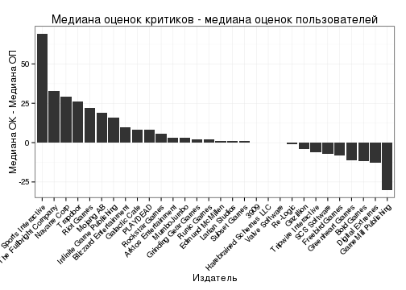

# Описательный анализ данных Metacritic

## Аннотация

В исследовании проведён сбор и описательный анализ данных сайта www.metacritic.com.
Проверяется гипотеза о том, что в большинстве случае оценки критиков и оценки пользователей значительно расходятся, 
и гипотеза о том, что год издания игры негативно ассоциирован с её оценкой.
Выявлена проблема репрезентативности данных Metacritic.

## Введение

Интернет-проект Metacritic (http://www.metacritic.com) является одним из сайтов, публикующих сводные рейтинги компьютерных и видеоигр. 
Выбор Metacritic в качестве объекта исследования обусловлен использованием его рейтингов в сервисах цифровой дистрибуции (Steam, Amazon и т.д.), 
в том числе в их рекомендательных движках, что может определять потребительский выбор. 
Кроме того, в случае, если данные Metacritic репрезентативны относительно популяции игроков и игровых критиков,
их можно рекомендовать к изучению в исследованиях мнений игроков и т.п.
Система агрегирования оценок на Metacritic предполагает выставление каждой игре двух оценок: оценки критиков (metascore),
рассчитывающейся как взвешенное среднее оценок, выставленных профессиональными рецензентами игровых медиа. 
Причём алгоритм распределения весов и метод вычленения численных оценок из текстов, в которых нет численной оценки, не описаны в публичном доступе. 
Вторая оценка &mdash; это оценка пользователей (user score), рассчитывающаяся как среднее арифметическое оценок, введённых зарегистрированными пользователями Metacritic. 
Целью данного исследования является описательный анализ и визуализация данных Metacritic из категории "Игры для ПК" (PC Games), 
выбранной для исследования ввиду наибольшей длительности жизненного цикла ПК как игровой платформы. 
Данные рассматриваются в разрезе по времени, по игровому жанру и др., сравниваются оценки пользователей (ОП) и критиков (ОК), выявляются закономерности.
Предпосылкой исследования являются две гипотезы: первая &mdash; что в большинстве случае ОК и ОК значительно расходятся, 
и вторая &mdash; что в среднем пользователи оценивают игры, выпущенные до 2000 года выше игр, выпущенных после этой даты.

## Методы исследования

Сбор данных с сайта metacritic.com был произведён 19 октября 2014 года с помощью фреймворка Scrapy.
Для каждой игры были извлечены: название, ОП, количество ОП, ОК, количество ОК, 
издатель, год издания, разработчик, платформа, жанр, тэги, возрастной рейтинг, ссылка.
Затем полученные данные обрабатывались средствами описательной статистики языка программирования R.
Исходный код для извлечения и анализа данных доступны по адресу: is.gd/metacritic_code; набор данных в формате, поддерживаемом MS Excel, 
по адресу is.gd/metacritic_xls.

## Результаты

Общее число игр, представленных на Metacritic для платформы "Персональный компьютер", составляет 3031.
Как ОП (мода = 84), так и ОК (мода = 77) 
не являются нормально распределёнными согласно критерию Шапиро-Уилка.
По годам игры распределены неравномерно: в 1994 представлена одна игра, в 2013 достигнут максимум &mdash; 303 игры.
Число оценок растёт от года к году: от 215 ОП и 5 ОК в 1994 
до 91369 ОП и 5112 ОК в 2013. 
В одномерной линейной модели год издания значимо связан с ОП (P < 0.0001), с коэф. B = -0.7634 
и R^2 = 5.5%.
Таким образом, чем раньше выпущена игра, тем выше её оценивают пользователи (см рис.1).
 
Наблюдается существенная разница между медианой ОП и медианой ОК.
В разрезе по жанрам максимальная разница наблюдается для жанра Sports и составляет 7 баллов.
В разрезе по издателям также имеется расхождение между ОП и ОК; на рис. 2 показана разница между медианами ОП и ОК для 30 издателей из верхней квартили 
по числу ОП (т.е. издателей, игры которых получили наибольшее внимание пользователей Metacritic).
 

5 игр, ОК и ОП которых больше всего расходятся: Out of the Park Baseball 2007, Navy SEALs: Weapons of Mass Destruction, Company of Heroes 2, Gods and Generals, Out of the Park Baseball 6.
В целом, пользователи оценили 48% игр выше, чем критики, 40% ниже, чем критики, и в 4% случаев оценки сравнялись 
(8% приходится на случаи, где отсутствует одна или обе оценки).

## Заключение

Полученные данные свидетельствуют о значительных расхождениях между оценками пользователей и оценками критиков в большинстве случаев.
Также подтверждается гипотеза об отрицательной корреляции между годом выпуска игры и её оценкой.
В целом, возникает сомнение в репрезентативности данных Metacritic. 
Источники данных, как в части профессиональных рецензий, так и в части пользовательских данных, не имеют явного формализованного контроля.
Методика расчёта оценок далека от прозрачности, математической точности и универсальности, декларируемой разработчиками Metacritic. 
Актуальной задачей на будущее видится сбор большего количества данных, более глубокий анализ предвзятости критиков, связи их оценок с конкретными издателями, охват большего числа платформ, сравнение данных Metacritic с данными аналогичных порталов.

## Список литературы
